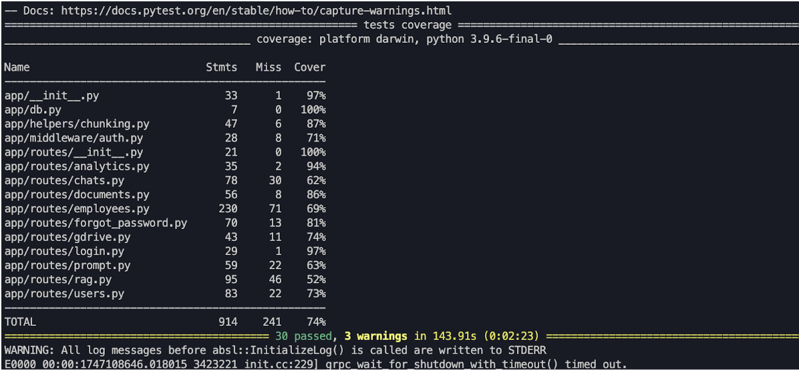

# Prosterio Server

A Flask-based backend API server for the Prosterio application with JWT authentication and Swagger documentation.

## Features

- RESTful API endpoints
- JWT Authentication
- Swagger API documentation
- PostgreSQL database integration
- Role-based access control

## Tech Stack

- **Framework**: Flask
- **Documentation**: Flasgger/Swagger
- **Authentication**: JWT
- **Database**: PostgreSQL
- **Password Hashing**: bcrypt

## Getting Started

### Prerequisites

- Python 3.8+
- PostgreSQL
- pip

### Installation

1. Clone the repository:
   ```bash
   git clone <repository-url>
   cd server-prosterio
   ```
2. Install dependencies:
   ```bash
   pip install -r requirements.txt
   ```
3. Create file .env like this format:
   ```bash
    EMAIL_OTP=
   EMAIL_PS_OTP=
   GEMINI_APIKEY=
   GOOGLE_CERT_URL=
   GOOGLE_CLIENT_EMAIL=
   GOOGLE_CLIENT_ID=
   GOOGLE_PRIVATE_KEY=
   GOOGLE_PRIVATE_KEY_ID=
   GOOGLE_PROJECT_ID=
   GROQ_API_KEY=
   JWT_SECRET=
   SF_OCSP_FAIL_OPEN=
   SNOWFLAKE_ACCOUNT=
   SNOWFLAKE_DATABASE=
   SNOWFLAKE_PASSWORD=
   SNOWFLAKE_SCHEMA=
   SNOWFLAKE_USER=
   SNOWFLAKE_WAREHOUSE=
   ```
   or check file `.env_template`
4. Run the application:
   ```bash
   python main.py
   ```

## API Documentation

The API documentation is available at `/apidocs` once the application is running.

# Authentication

The API uses JWT (JSON Web Token) for authentication. To access protected endpoints:

1. Obtain a token by sending a POST request to /api/login with valid credentials
2. Include the token in the Authorization header of subsequent requests:

```bash
Authorization: Bearer <your_token>
```

# Testing

```
$ python -m pytest tests/ --cov=app
```


